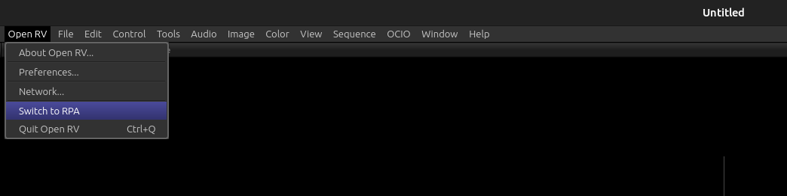

Open RV Implementation
======================

.. contents::
   :local:
   :depth: 1

========
Overview
========
RPA implementation in Open RV has been done using the following 2 RV Packages that you can find in the RPA repo,

1. ./open_rv/pkgs/rpa_core_pkg/rpa_core_mode.py
2. ./open_rv/pkgs/rpa_widgets_pkg/rpa_widgets_mode.py

=====================
RPA Core - Rv Package
=====================
In the RPA repository, the RV Package responsible for adding RPA Core into RV can be found at:
**./open_rv/pkgs/rpa_core_pkg/rpa_core_mode.py**

At its core, RPA is a collection of abstractions designed to support the development of RPA-widgets that support review-workflows in VFX & Animation studios. These widgets rely on the RPA abstractions for their functionality.

To make practical use of these widgets, they must be run inside a review player that provides an actual implementation of the RPA abstractions. We refer to this implementation as the RPA Core.

In the context of RV, all RPA abstractions across various RPA modules are implemented as an RV Package.

The implementation is designed such that the RPA session is treated as the source of truth, not the RV session. This means updates flow from the RPA session to the RV session: the RPA session is updated first, and the RV session is then synchronized based on the state of the RPA session.

The RPA Core instance is attached to QtWidgets.QApplication instance of Open RV.

.. code-block:: python

   app = QtWidgets.QApplication.instance()
   app.rpa_core = self.__rpa_core

This is done so that subsequent RV packages that have RPA widgets, can get the RPA Core instance from the QtWidgets.QApplication instance.

========================
RPA Widgets - Rv Package
========================
In the RPA repository, the RV Package responsible for adding all available RPA widgets into RV can be found at:
**./open_rv/pkgs/rpa_widgets_pkg/rpa_widgets_mode.py**

---------
RPA Mode:
---------
Since RPA has its own Session that works on top of the RV Session, using RV widgets that directly manipulate the RV Session without going through the RPA Session will cause unexpected behavior. So this RV Package, adds a menu in RV's main menu-bar called **Open RV -> Switch to RPA**.

By default RPA mode is not enabled so that you can continue to use all RV Session features without any interference from RPA Session. When you are want to use RPA Session with all the RPA widgets, you can enable RPA Mode by clicking on the **Open RV -> Switch to RPA** menu in the main menu-bar of RV.

When you enter RPA mode your current RV Session will be cleared and many RV features/widgets will be replaced/disabled to accommodate RPA Session. So make sure to save your RV Session if needed before proceeding.

~~~~~~~~~~~~~~~~~~~~~~~~~
RPA Mode User Experience:
~~~~~~~~~~~~~~~~~~~~~~~~~

In RPA mode, after the following RV featurs are replaced/disabled you will be able to use the remaining RV features/widgets interchangeably with RPA widgets for the most part.

For the best RPA Mode user experience, it is recommended to primarily use RPA widgets instead of default RV widgets for your review feedback workflows. This is because the RPA widgets are designed to work seamlessly with the RPA Session and provide a more consistent user experience.

~~~~~~~~~~~~~~~~~
Widgets Replaced:
~~~~~~~~~~~~~~~~~
- RV Session Manager is replaced by **RPA Session Manager** (toggle with 'x' hotkey)
- RV Timeline is replaced by **RPA Timeline Manager** (toggle with 'F2' hotkey)
- RV Annotation Tools is replaced by **RPA Annotation Tools** (toggle with 'F10' hotkey)

~~~~~~~~~~~~~~
Menus Removed:
~~~~~~~~~~~~~~
- **File**
- **Edit**
- **Annotation**
- **Sequence**
- **Stack**
- **Layout**
- **Control**
   - Next Marked Frame
   - Prev Marked Frame
   - Matching Frame Of Next Source
   - Matching Frame Of Previous Source
- **Tools**
   - Default Views
   - Sequence
   - Replace
   - Over
   - Add
   - Difference
   - Different (Inverted)
   - Title
   - Menu Bar
   - Top View Toolbar
   - Bottom View Toolbar
   - Session Manager
   - Annotation
   - Timeline
- **Image**
   - Rotation
   - Flip
   - Flop
   - Cycle Stack Forward
   - Cycle Stack Backward
- Right clicking on the viewport will not show the RV context menu.
- Middle-Mouse-Click & drag will not translate the viewport. You can use Middle-Mouse-Click with Alt modifier and drag to do this instead.

~~~~~~~~~~~~
Menus Added:
~~~~~~~~~~~~
- **File(rpa)**
   - Add Clips
   - Save RPA Session
   - Append Save RPA Session
   - Replace Save RPA Session
- **Tools->RPA Widgets**
   - Session Manager
   - Background Modes
   - Annotation Tools
   - Color Corrector
   - Timeline
   - Media Path Overlay
   - Session Assistant
   - RPA Interpreter
   - Show FStop Slider
   - Show Gamma Slider
   - Show Rotation Slider
- Double clicking on the viewport will enable users to add media as RPA Clips instead of RV source-groups.

~~~~~~~~~~~~~~
Exit RPA Mode:
~~~~~~~~~~~~~~

Once you enter RPA mode, Open RV will continue to stay in RPA mode even when you close and open Open RV. To exit out of RPA mode you can use the following menu from the main menu-bar of Open RV, **Open RV -> Exit out of RPA**.

When you exit RPA mode, your current Open RV will be closed and the next time you open Open RV it will launch in normal Open RV mode. So make sure to save your RPA session if needed before exiting RPA mode.

-----------------------------
Setting up RPA widgets in RV:
-----------------------------

To use RPA widgets within RV, two key components are required:

1. An instance of RPA with the RPA Core added as a core delegate.
2. The MainWindow instance used by the review player (RV).

In the file mentioned above, you will see how:

1. An RPA instance is created. RV's implementation of the RPA Core is added to it as the core delegate.
2. The MainWindow is obtained from RV using rv.qtutils.sessionWindow()

.. code-block:: python

   from rpa.rpa import Rpa
   ...

   self.__main_window = rv.qtutils.sessionWindow()
   app = QtWidgets.QApplication.instance()
   self.__rpa_core = app.rpa_core

   self.__rpa = Rpa(create_config(self.__main_window), create_logger())
   default_connection_maker.set_core_delegates_for_all_rpa(
      self.__rpa, self.__rpa_core)

Next, instances of the desired RPA widgets are created by passing:

1. The RPA instance, and
2. RV's MainWindow.

.. code-block:: python

   from rpa.widgets.session_manager.session_manager import SessionManager
   ...
   self.__session_manager = SessionManager(self.__rpa, self.__main_window)

====================================================
How to build and install the above RPA RV Packages ?
====================================================
Follow the step by step instructions in **./rpa/README.md** under the "Build and Install" heading.

=================
Media Attribution
=================

Documentation includes clips/screenshots from *Big Buck Bunny* by the Blender Foundation, licensed under [CC BY 3.0](https://creativecommons.org/licenses/by/3.0/).
Source: https://peach.blender.org/
